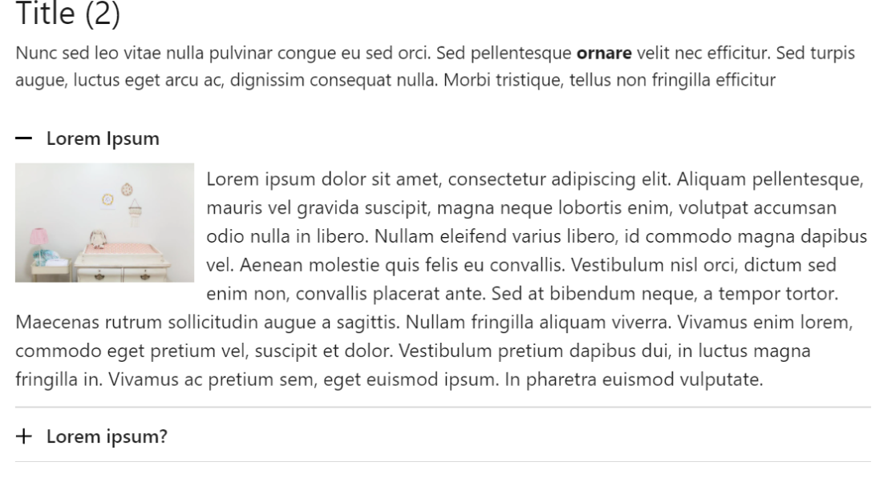

# Blend Shopify Developer Test

## Software
[Theme Kit](https://shopify.dev/themes/tools/theme-kit)
or 
[Shopify CLI](https://shopify.dev/themes/tools/cli) 
If you are using Theme Kit please use ``--allow-live`` flag

## Links
- [Shop](https://blend-qa.myshopify.com/)
- [Customize Theme](https://blend-qa.myshopify.com/admin/themes/127601475759/editor)
- [Edit Code](https://blend-qa.myshopify.com/admin/themes/127601475759)

 Theme installed on the store is Shopify 2.0 compliant. 

# Test
Create accordion section that will allow merchant add:
- Section title
- Section subtitle
- Block with
    - accordion title
    - accordion text
    - accordion image (optional)

Embed section on the homepage and style as image below:

